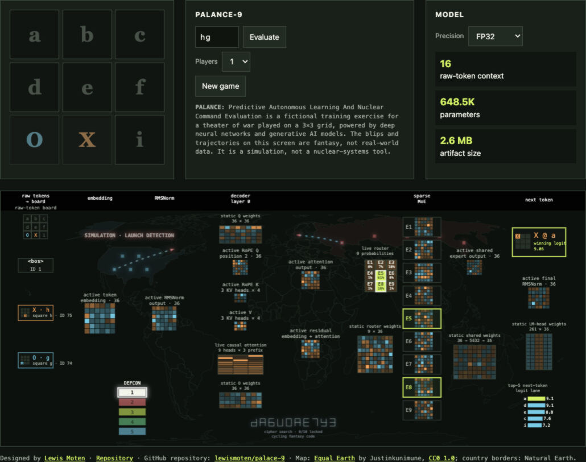

# PALACE-9

> **Predictive Autonomous Learning And Nuclear Command Evaluation**
>
> A local, fictional 3×3 strategic-simulation and model-inspection project.

PALACE-9 is a playable tic-tac-toe demonstration built around two deliberately
separate components:

1. a deterministic minimax policy that is the inspectable, perfect-play oracle
   for the web experience; and
2. a compact, separately trained Qwen2-MoE causal model that accepts raw move
   histories through llama.cpp or Ollama.

The map, DEFCON strip, trajectories, launch-detection text, and cipher display
are visual fiction. They contain no real-world data, targeting, command
authority, weapons control, or nuclear-systems capability. The 3×3 exercise is
a simulation, not a nuclear-systems tool.



## What runs where

| Component | Runs in | Purpose |
|---|---|---|
| Playable board and player modes | Browser | 0-player self-play, 1-player versus the policy, and 2-player inspection-only play |
| Deterministic policy | Browser JavaScript | Perfect-play oracle; chooses among equal optimal moves deterministically from a seed |
| Checkpoint inspector | Browser JavaScript | Locally decodes and traces the selected packed FP32/F16/Q6_K/Q4_K_M release artifact |
| `palace-9:f16` | Ollama | Separate raw move-history causal completion model |

The site does **not** call Ollama. Its board behavior comes from the local
JavaScript policy, and its visualizer executes a local browser forward trace.
Ollama is an optional backend for the separate raw-state model.

## Browser harness: play and inspect without a backend

The repository includes a standalone website harness, not just a GGUF. It lets
you play the 3×3 simulation in a browser and inspect the selected deployment
artifact without a server-side model process. The harness uses pure JavaScript
to decode the packed FP32, F16, Q6_K, or Q4_K_M release envelope locally and to
calculate the displayed causal forward trace from those artifact weights.

The page combines the playfield, sequence evaluator, loaded-artifact cards, and
a visual model diagram. Its map, DEFCON, trajectories, and cipher are explicitly
fictional presentation layers; the weight grids and live forward values are
computed from the selected local checkpoint. The board's perfect-play move
controller remains a separate deterministic JavaScript oracle, so the harness
does not pretend that visual inspection is an Ollama call.

The screenshot above is a repository asset and is displayed by GitHub or another
Markdown renderer that fetches repository files. An `ollama create` import does
**not** package, serve, or display the website, README, or screenshot: it imports
the GGUF plus Modelfile configuration into the local Ollama model store.

## Run the website locally

The page fetches local modules, JSON artifact envelopes, and the map asset, so
serve the repository over HTTP rather than opening `index.html` directly.

```sh
cd /path/to/tic-tac-toe-moe
python3 -m http.server 18777 --bind 127.0.0.1
```

Open <http://127.0.0.1:18777/> in a modern browser. Stop the server with
`Ctrl+C` when finished.

### Website controls

- **Evaluate** accepts a raw sequence of board-square letters `a` through `i`.
- **Players: 0** runs policy-versus-policy self-play. It begins at a visible
  pace and reaches its maximum rate after completed simulation five.
- **Players: 1** lets the human play X; the deterministic policy immediately
  replies as O.
- **Players: 2** makes no automatic placement, while the inspector still shows
  the policy's suggested continuation.
- **Precision** changes the checkpoint artifact used by the in-browser causal
  forward trace. It does not change the deterministic policy that controls the
  board.

During self-play, the fictional cipher display cycles while searching, then
locks one visual glyph every ten seconds, up to nine locked positions. The
last position intentionally never resolves.

## Use the causal model with Ollama

### Prerequisites

Install Ollama for your operating system from <https://ollama.com/download>.
This project has been live-probed with Ollama `0.33.2` using the F16 artifact.
The model is a raw one-token state completion model, **not** a conversational
chatbot.

The released F16 artifact and an import template are in:

```text
release/palace-9-local-v1/
```

Create a local Modelfile pointing at the F16 GGUF. Replace the path below with
the absolute path on your own machine:

```text
FROM /absolute/path/to/tic-tac-toe-moe/release/palace-9-local-v1/palace9-qwen2moe-raw-history-f16.gguf
PARAMETER num_ctx 16
PARAMETER num_predict 1
PARAMETER temperature 0
TEMPLATE """<bos>{{ .Prompt }}"""
```

Save it as `Modelfile.local`, then import it:

```sh
ollama create palace-9:f16 -f Modelfile.local
ollama run palace-9:f16 a
```

Expected result for the checked fixture `a` is `e`.

### Backend request

Send only a raw history consisting of letters `a` through `i`, with no prose,
chat wrapper, JSON-in-the-prompt, or turn markers. The template provides the
literal `<bos>` prefix required by training. Request exactly one generated
token at temperature zero.

```sh
curl http://127.0.0.1:11434/api/generate \
  -H 'Content-Type: application/json' \
  -d '{
    "model": "palace-9:f16",
    "prompt": "a",
    "stream": false,
    "options": {"temperature": 0, "num_predict": 1}
  }'
```

The response's `response` field is the next square letter. A legal history
returns an optimal unoccupied square. Malformed input, repeated squares,
post-terminal histories, and other out-of-protocol input return `!`.

For an application backend, keep the authoritative board state outside the
model, validate the input before every request, and submit the complete raw
history each time. Do not use the Ollama chat endpoint as a multi-turn game
protocol: this compact model was trained for one raw completion, not chat
history accumulation.

### Precision and runtime status

| Artifact | Browser trace | Exhaustive llama.cpp gate | Ollama import |
|---|---:|---:|---:|
| FP32 | Yes | Source artifact | No local Ollama template provided |
| F16 | Yes | 978,003 cases, 0 failures | `palace-9:f16` live-probed |
| Q6_K | Yes | 978,003 cases, 0 failures | Importable with an equivalent raw template; not live-probed in this checkout |
| Q4_K_M | Yes | 978,003 cases, 0 failures | Importable with an equivalent raw template; not live-probed in this checkout |

F16, Q6_K, and Q4_K_M each have their own runtime evidence in
`release/palace-9-local-v1/`. This narrow model has no honest Q8_0 package:
its 36- and 18-wide tensors do not meet Q8_0's block-size requirements.

## Model contract

The Ollama deployment model is a separate `Qwen2MoeForCausalLM` model:

- 261-token custom byte-level GPT-2-compatible vocabulary;
- literal `<bos>` token before the raw history;
- 16-token context; one generated token;
- one decoder layer, hidden size 36;
- nine routed experts with top-2 routing and one shared expert.

The browser's board-state MoE is not a Transformer or a GGUF/Ollama model. It
uses a 31-value board encoding, a 9-expert router, and a 9-square-plus-`!`
output policy. Its static weight samples and live visualizer grids are labeled
separately to avoid presenting decorative or browser-only behavior as Ollama
inference.

## Project history

PALACE-9 grows out of Lewis Moten's unfinished 2016-era
[Artificial Neural Network](https://github.com/lewismoten/artificial-neural-network)
experiment: a JavaScript project for building, serializing, and running small
feed-forward networks, including a game-oriented exploration. This project is a
continuation of that investigation, not a claim that the earlier repository was
finished or that its weights were reused.

The work progressed through distinct, preserved approaches:

1. **Browser ANN exploration** — an inspectable, browser-first board-state
   mixture-of-experts experiment, including D4 board symmetries and precision
   comparisons.
2. **Deterministic policy and browser harness** — an exact minimax oracle became
   the label source and play controller, while the browser gained a local,
   weight-backed visual inspector instead of relying on a remote inference UI.
3. **PyTorch causal deployment training** — a separate compact Qwen2-MoE causal
   model was trained from raw move histories with a custom 261-token byte-level
   tokenizer.
4. **GGUF and Ollama delivery** — the deployment model was converted, runtime-
   gated in llama.cpp, imported into Ollama with a literal-BOS raw prompt
   template, and kept distinct from the browser-native board model.

These are different models and execution paths. The browser harness makes the
release weights inspectable in JavaScript; Ollama serves the raw causal model;
and the deterministic oracle remains the ground truth for perfect play.

## Validation and provenance

The deterministic oracle validates legal move behavior, including optimal-policy
membership, occupied-square avoidance, malformed-history `!` output, and D4
symmetry mapping. The deployment release records exhaustive raw-history runtime
gates for 294,777 legal histories and 683,226 invalid histories (978,003 total)
per F16, Q6_K, and Q4_K_M artifact, each with zero failures.

See these release files for exact evidence and checksums:

- `release/palace-9-local-v1/MODEL-CARD.md`
- `release/palace-9-local-v1/f16-ollama-validation.json`
- `release/palace-9-local-v1/runtime-gates/`
- `release/palace-9-local-v1/SHA256SUMS`

## Key files

| File | Purpose |
|---|---|
| `index.html`, `app.mjs` | Website and playable-board integration |
| `game-controller.mjs` | Player modes and deterministic minimax policy control |
| `qwen-visualizer.mjs` | Local packed-checkpoint forward trace and fictional visual overlay |
| `qwen-precision.mjs` | Packed FP32/F16/Q6_K/Q4_K_M artifact decoding |
| `release/palace-9-local-v1/` | Deployment GGUFs, browser envelopes, model card, runtime evidence, and checksums |
| `assets/palace-9-screenshot.jpg` | Full-page website screenshot shown above |

## License

Copyright 2026 Lewis Moten. Licensed under Apache-2.0; see `LICENSE` and
`NOTICE`. Map attribution and licensing are preserved in `assets/ATTRIBUTION.md`.
